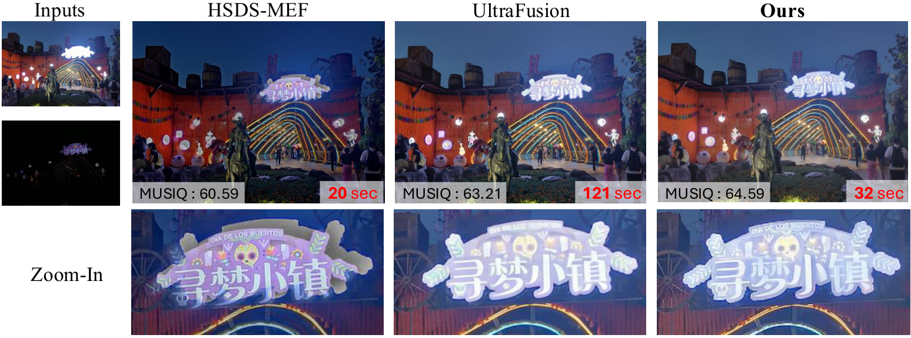

# LIIFusion

Official implementation of **LIIFusion: Coarse-to-fine Framework for
Generative MEF via Implicit Neural Representation** (ECCV 2026).

<p align="center">
  <a href="https://arxiv.org/abs/2607.17611">arXiv</a> |
  <a href="https://arxiv.org/pdf/2607.17611">Paper</a> |
  <a href="https://sangmin213.github.io/LIIFusion/">Project Page</a>
</p>

<p align="center">
  
</p>

LIIFusion combines a frozen [UltraFusion](https://github.com/OpenImagingLab/UltraFusion)
coarse fusion stage with a trainable SwinIR-LIIF fine fusion module. This
repository contains the complete fine-module training path and end-to-end
inference path.

## Pipeline

1. **Adaptive exposure correction** maps underexposed (UE) intensities toward
   the overexposed (OE) distribution with an intensity mapping function (IMF).
   The corrected image is used for robust RAFT flow estimation.
2. **Square padding** pads the corrected UE, original UE, and OE images to a
   common square without changing their aspect ratio.
3. **Coarse fusion** downsamples both aligned exposures to `768 x 768` and runs
   UltraFusion.
4. **Fine fusion** uses the coarse result as the low-resolution implicit
   representation and extracts local patches from the original-resolution OE
   and aligned UE images. A trained SwinIR-LIIF model queries the final image at
   every target coordinate.
5. The square output is cropped back to the original image dimensions.

## Repository layout

```text
LIIFusion/
|-- configs/
|   |-- coarse/                 # UltraFusion and fidelity encoder definitions
|   `-- fine/                   # SwinIR-LIIF training configuration
|-- lte_datasets/               # Fine-module training data and wrappers
|-- lte_models/                 # SwinIR, LIIF, guide network, and MLP
|-- model/                      # UltraFusion, Stable Diffusion, and RAFT models
|-- pipeline/                   # UltraFusion coarse pipeline
|-- utils/                      # Flow, sampler, and model utilities
|-- train.py                    # Fine fusion training
`-- inference.py                # Complete coarse-to-fine inference
```

The files under `assets/` and `index.html` are the ECCV 2026 project page.

## Installation

The code targets Python 3.10, PyTorch 2.3, and CUDA 12.1.

```bash
conda create -n liifusion python=3.10 -y
conda activate liifusion
pip install torch==2.3.0 torchvision==0.18.0 --index-url https://download.pytorch.org/whl/cu121
pip install -r requirements.txt
```

`xformers` is optional. PyTorch scaled dot-product attention is used when
available.

## Checkpoints

Create `ckpts/` and place the following files in it:

```text
ckpts/
|-- v2-1_512-ema-pruned.ckpt
|-- ultrafusion.pt
|-- fcb.pt
|-- raft-sintel.pth
`-- swinir-liif.pth
```

The first four weights are the public UltraFusion dependencies:

| File | Source |
|---|---|
| `v2-1_512-ema-pruned.ckpt` | [Stable Diffusion 2.1 base](https://huggingface.co/stabilityai/stable-diffusion-2-1-base/blob/main/v2-1_512-ema-pruned.ckpt) |
| `ultrafusion.pt` | [UltraFusion](https://huggingface.co/zxchen00/UltraFusion/blob/main/ultrafusion.pt) |
| `fcb.pt` | [UltraFusion FCB](https://huggingface.co/zxchen00/UltraFusion/blob/main/fcb.pt) |
| `raft-sintel.pth` | [UltraFusion RAFT weights](https://drive.google.com/drive/folders/1sWDsfuZ3Up38EUQt7-JDTT1HcGHuJgvT) |

Train `swinir-liif.pth` as described below or use the released LIIFusion fine
fusion checkpoint.

## Train the fine fusion module

Arrange paired training and validation images as follows. Sorted file names in
`Label`, `OE`, and `UE` must correspond one-to-one and all paired images must
have equal dimensions.

```text
load/
|-- train/
|   |-- Label/                  # Target fused images
|   |-- OE/                     # Overexposed guidance images
|   `-- UE/                     # Underexposed guidance images
`-- valid/
    |-- Label/
    |-- OE/
    `-- UE/
```

Run:

```bash
python train.py \
  --config configs/fine/train_swinir-liif.yaml \
  --name swinir-liif \
  --gpu 0
```

Checkpoints and TensorBoard logs are written to `save/swinir-liif/`.
`epoch-best.pth` is selected by validation PSNR. To resume training, set
`resume` in the YAML file to an existing `epoch-last.pth`.

The released configuration trains with random scales in `[1, 4]`, `48 x 48`
coarse patches, 2,304 implicit coordinate samples, and `19 x 19` OE/UE guide
patches.

## Inference

Run a single exposure pair:

```bash
python inference.py \
  --underexposed examples/scene_ue.png \
  --overexposed examples/scene_oe.png \
  --liif-checkpoint ckpts/swinir-liif.pth \
  --output results/scene.png
```

Checkpoint paths default to the names shown in the checkpoint layout. Override
them with `--sd-checkpoint`, `--ultrafusion-checkpoint`, `--fcb-checkpoint`,
and `--raft-checkpoint` when needed.

For batch inference, place each pair in a scene directory. File names must
contain `_ue` and `_oe` as separate tokens:

```text
data/
|-- scene_001/
|   |-- image_ue.png
|   `-- image_oe.png
`-- scene_002/
    |-- image_ue.jpg
    `-- image_oe.jpg
```

```bash
python inference.py \
  --input-dir data \
  --liif-checkpoint ckpts/swinir-liif.pth \
  --output results
```

The guide patch size is inferred from the fine checkpoint. Reduce
`--query-batch-size` from its default of `30000` if fine fusion runs out of
GPU memory. Use `--disable-exposure-correction` only for the corresponding
ablation.

## Acknowledgements

This implementation builds on
[UltraFusion](https://github.com/OpenImagingLab/UltraFusion),
[LTE](https://github.com/jaewon-lee-b/lte),
[LIIF](https://github.com/yinboc/liif), and
[SwinIR](https://github.com/JingyunLiang/SwinIR).

## License

The combined repository is distributed under [GPL-3.0](LICENSE). LTE-derived
components retain their [BSD-3-Clause notice](LICENSES/LTE-BSD-3-Clause.txt).
